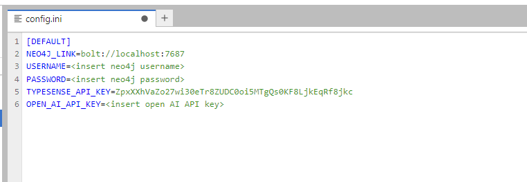

## Logging into Jupyter Lab

1. Open your web browser and navigate to the Jupyter Lab page. The URL should be as following 'http://<VM_IP_ADDRESS>:8888'

2. Enter the token provided to you.

3. Once logged in, you will be able to see and run the Jupyter Notebooks.

4. The Jupyter Notebooks are organised in the following directory structure.
    1. [API](#api) - It contains the Python Flask Server code and a Jupyter book which consumes the API of the Flask server.
    2. [Concept_Notebooks](#concept_notebooks) - It contains the Jupyter notebooks thjat utilise various llm models to create cypher queries based on the natural language text.
    3. [Data_Pipeline](#data_pipeline) - It contains the Jupyter notebook that takes a serach term and creates a graph for a given serach term using Open AI and Typesense to get data. 

## Creating an Open AI Key

To run the Jupyter Notebooks, you'll need a Open-AI API key. The steps to create an Open-AI API key are given below:

1. Go to OpenAI's Platform website and sign in with an OpenAI account.

2. Click your profile icon at the top-right corner of the page and select "View API Keys."

3. Click "Create New Secret Key" to generate a new API key.

4. Save the generated API key.

## Setting up Config file

For accessing the various services running on the VM we need to setup the credentails for them in the config.ini file.

1. Once in Jupyter lab, open the config.ini file.

2. Add the neo4j username and password.

3. Add Open AI key you generated earlier.

## Running the Jupyter Notebook

1.  Once in Jupyter lab, you can see all the directories abd files in the file browser in the left sidebar of Jupyter Lab.

2. Click on the notebook file you want to open it.

3. Jupyter Notebooks consist of cells, and there are different types of cells, including code cells and markdown cells. Code cells contain executable code, while markdown cells contain formatted text.

4. To run a markdown cell, you don't need to execute it in the same way you execute code cells. Instead, markdown cells are automatically rendered when you open the notebook.

5. Simply navigate through your notebook using the arrow keys or mouse, and the markdown content will be displayed.

6. If your notebook contains code cells, you can run them by selecting the cell and either clicking the "Run" button in the toolbar or using the keyboard shortcut 'Shift + Enter'. The output of the code cell will be displayed below the cell.

## API

1. server.py - This is the code for the Python Flask Server running on port 5000 of the virtual machine. It accepts the search topic and a llm model name. The API returns a list of researchers, grants and publications for the given search term. Internally, the llm produces 5 alternate words for the search term which is then serached in Typesense to get a list of DOIs and grant ids. This is then passed to Neo4j to get the final output. The API to reach the server is http://<VM_IP_ADDRESS>:5000/api/graph?topic=ocean&llm=mistral . You can pass the topic after "topic" as query parameter and choose between "mistral" and "openai" for llm models and pass it to llm query parameter.

2. API_Demo.ipynb - This Jupyter notebooks showcases the usage of Flask API deployed on the server that internally makes use of LLMs, Typesense and Neo4j to get data for the user specified keyword. 

## Concept_Notebooks

1. Code_Llama_Neo4j.ipynb - This Jupyter Notebook showcases an integration of Code Llama LLM and Neo4j for generating database queries from user input and retrieving corresponding data.

2. Mistral_Neo4j.ipynb - This Jupyter Notebook showcases an integration of Mistral LLM and Neo4j for generating database queries from user input and retrieving corresponding data.

3. OpenAI_Neo4j.ipynb - This Jupyter Notebook demonstrates how to leverage the OpenAI API to generate cypher queries from user questions and retrieve data from a Neo4j database.

## Data_Pipeline

1. Typesense_to_neo4j.ipynb - This Jupyter Notebook showcases an integration of OpenAI, Typesense and Neo4j for generating database queries from user input and retrieving corresponding data.