# Jenkins Login and GitHub Public Key Setup

## Github repositories required

Before proceeding with the next steps, please ensure that you have a Github account and access to the below Github repositories.

1. Jenkins Pipeline (https://github.com/data-community-of-practice/p0044)

2. Jupyter Notebooks (https://github.com/data-community-of-practice/vl-azure-ng-llm)

## Setting up Personal Access Token(PAT) in GitHub

1. Login to your Github account. (https://github.com)

2. Click on your profile picture in the top right and select "Settings"

3. Navigate to "Developer settings" in the left sidebar.

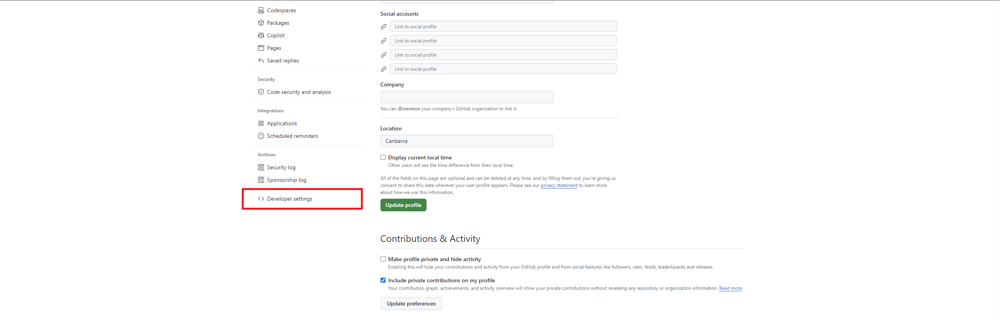

4. Click on "Personal access tokens" and then select "Tokens (Classic)".

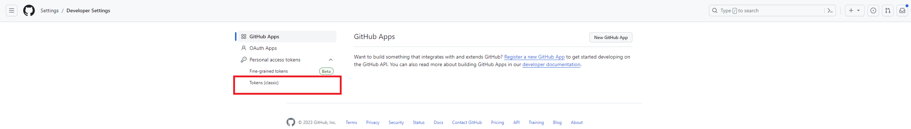

5. Click "Generate token" and then select "Generate new token (Classic)". 

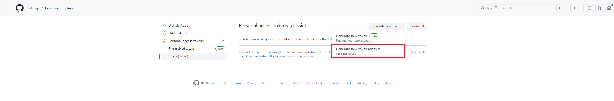

6. Give your token a name and check "repo" permission from the list of permissions and select Expiration as "No Expiration" and click "Generate Token".

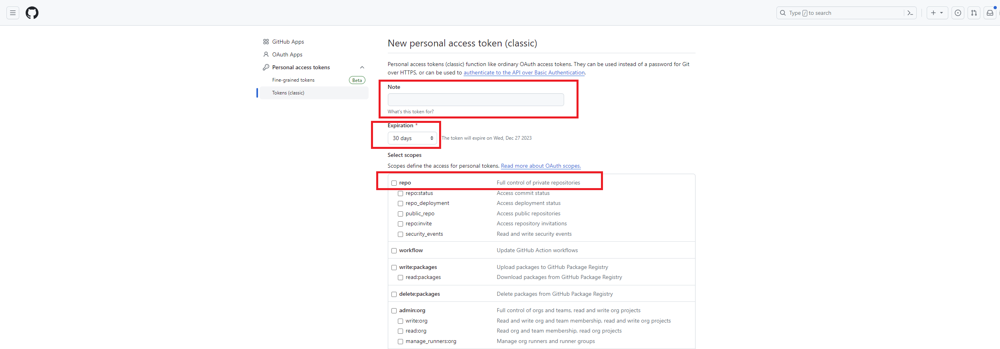

7. Copy the generated token to a secure location. This token will not be shown again.

## Steps to setup PAT in Jenkins

1. Open your web browser and navigate to the Jenkins login page. The URL should be as following 'http://<VM_IP_ADDRESS>:8080'

2. Enter your credentials (username and password) to log in to Jenkins.

3. Once logged in, you will be directed to the Jenkins dashboard.

4. In Jenkins, go to "Manage Jenkins" > "Credentials"

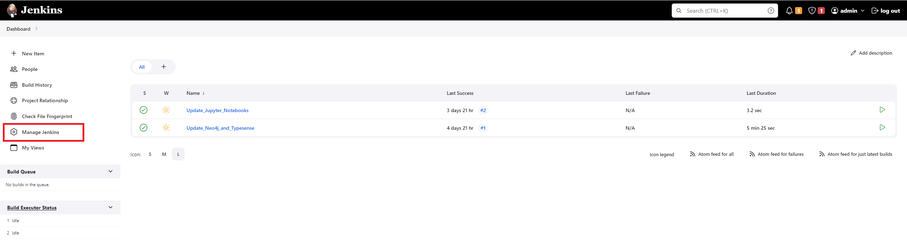

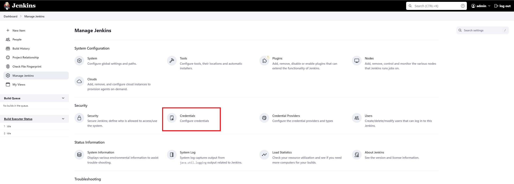

5. Under the "Stores scoped to Jenkins" section, click on "(global)".

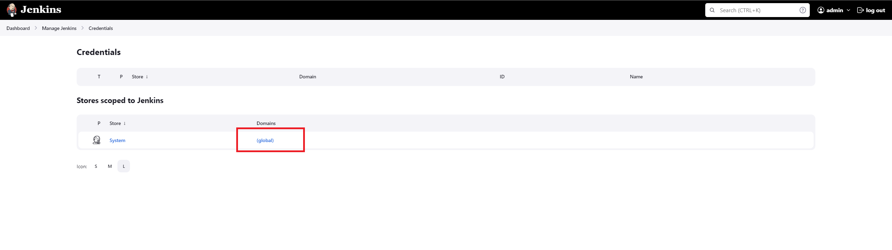

6. Click on "Add Credentials".

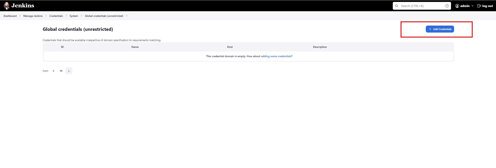

7. Select "Username and Password" for Kind.

8. In "Username" enter your Github username and in the "Password" add the Personal Access Token generated earlier.

9. In "ID" you can enter your Github useranme.

10. Provide and appropriate description in the "Description".

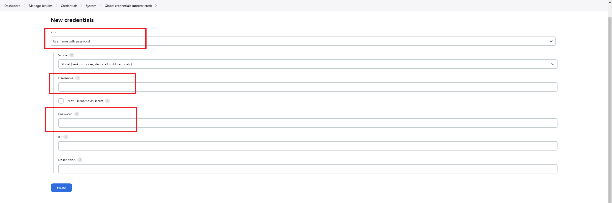

11. Click "Create" to create the credentials.

## Setting up the Pipeline

1. From the Jenkins dashboard, click on "Update_Neo4j_and_Typesense" pipeline.

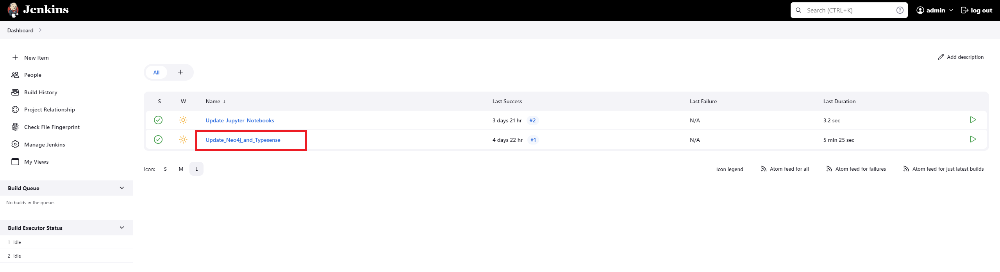

2. Select "Configure" from the left menu.

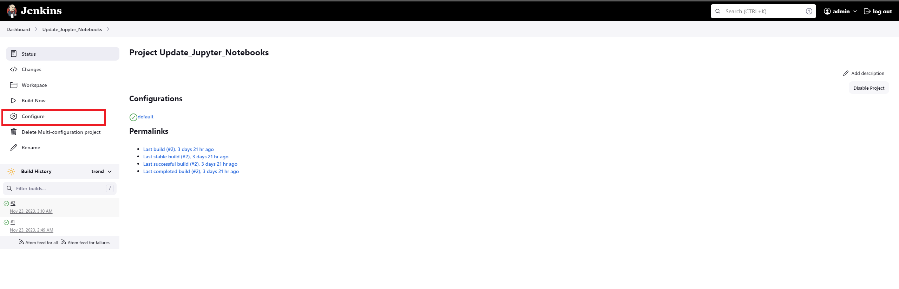

3. In the "Pipeline" section, select the Github username and PAT you configured in the previous steps from the credentials dropdown.

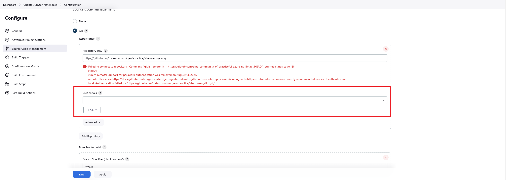

4. Click "Save".

5. Repeat the above steps for the "Update_Jupyter_Notebooks" pipeline.

## Running the Pipeline

1. From the Jenkins dashboard, click on "Update_Neo4j_and_Typesense" pipeline.

2. Click on the "Build Now" from the left menu. This will start the pipeline.

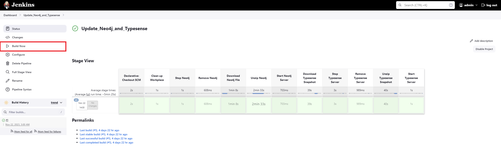

3. Please wait for the pipeline to finish and check if there are any errors.

4. You can run "Update_Jupyter_Notebooks", by follwing the above steps.